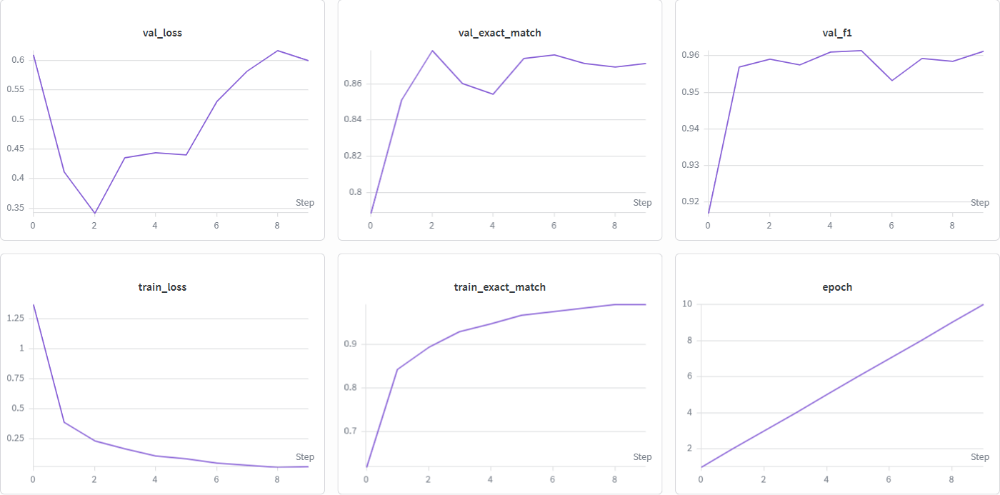

# Exact Match use BERT

>### Info
 >[The models are located on Hugging Face](https://huggingface.co/Nokish1/question-answering)
 >
 >The dependencies used in this project are located in requirements.txt 
 > ```python 
 >pip install -r requirements.txt
 >```

## 💼What is the repository about?

This project is an NLP: Question Answering task for finding sequences by tag in text. It was based on pre-trained BERT on Russian language and fine-tuned on a dataset containing excerpts from legal documents. Initially, this task was a selection for an internship at Kontur in 2023. [The task text, dataset, and comparison data were taken from here:](https://github.com/codemurt/kontur_internship_ds_nlp_2023.git)

## 🗂️Dataset

The dataset, as mentioned above, is a collection of legal documents. It contains the text of the document and a label, and the goal is to find the text that matches the label.

## Metrics on Fine-Tuning

I use a checkpoint from the third training epoch before the model started to overfit

>Validation loss: 0.34
>
>Validation accuracy: 0.88
>
>Validation F1: 0.96

## Metrics after compare with reference

The reference was taken from a GitHub file with a task

I can't say that the reference results are accurate, as they also contain many errors

>Similarity: 80.5%
>
>F1 where not similarity: 0.79

## 📈Learning curves on wandb



## Conclusions

I am satisfied with the results of this project, and I continue to develop in the field of NLP. I have achieved very good metrics, considering the complex structure of legal data.
